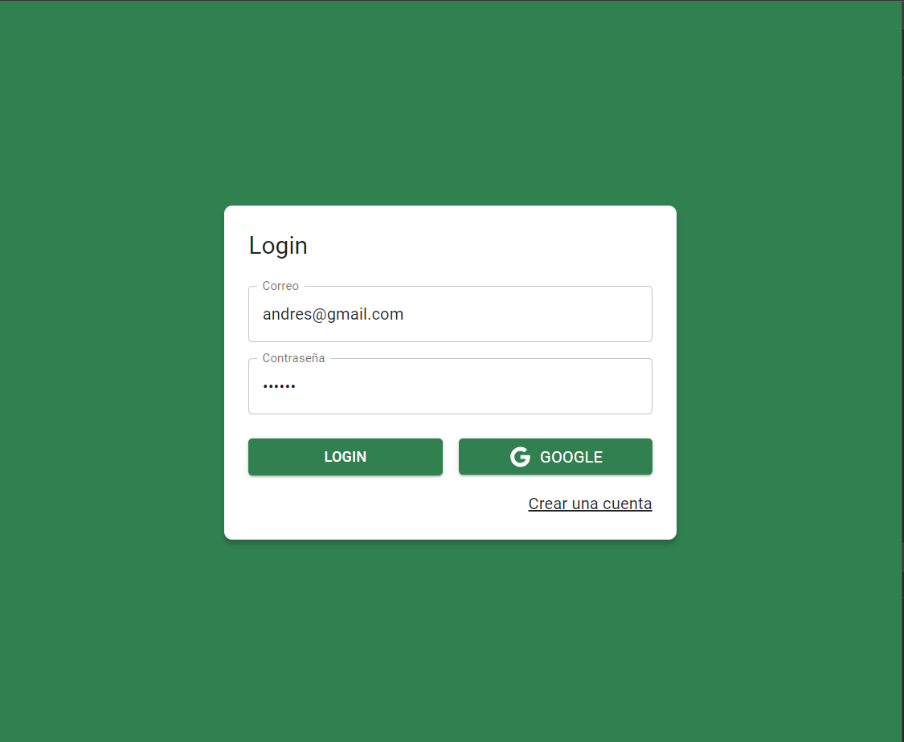
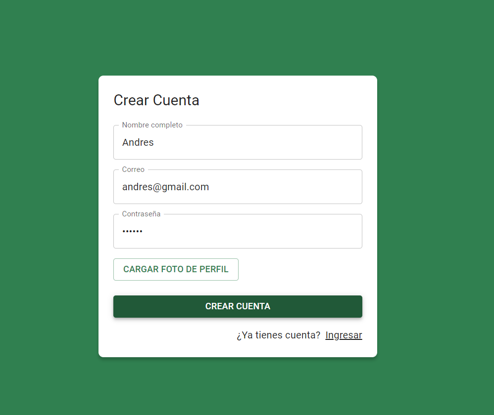
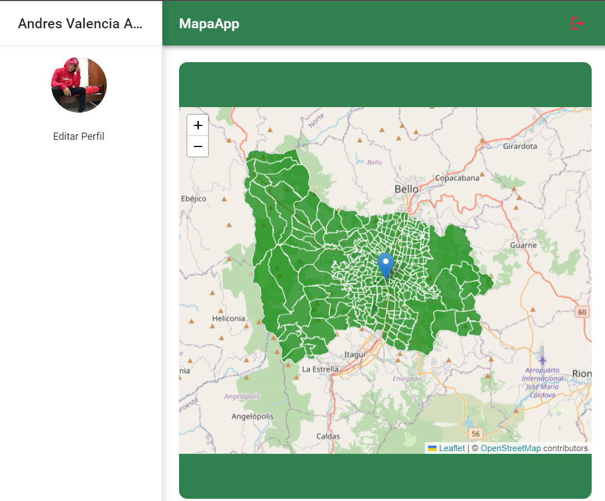
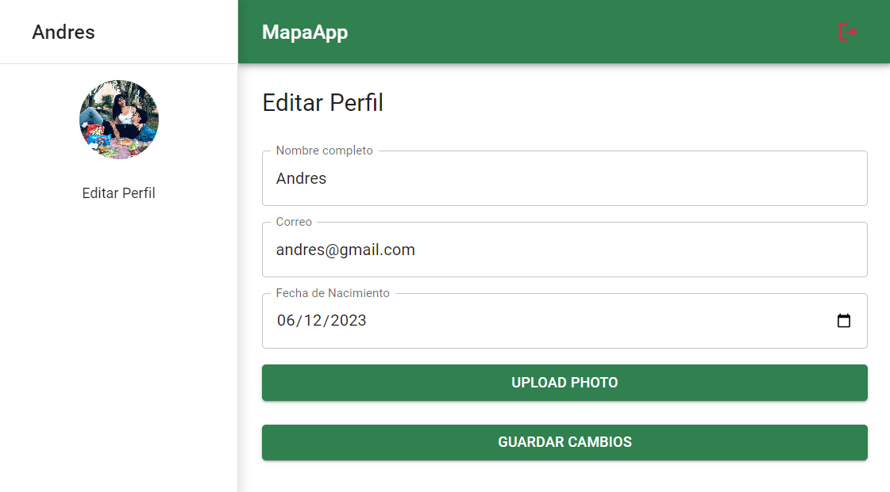

## MapasApp

### Descripción
MapasApp es una aplicación web que proporciona a los usuarios información visual sobre los barrios de Medellín, Colombia, a través de un mapa interactivo. Los usuarios pueden registrarse para acceder o iniciar sesión mediante Google. Además, la aplicación ofrece la posibilidad de actualizar el perfil, incluida la opción de cambiar la foto de perfil.

### Guía de Usuario - MapasApp

¡Bienvenido a MapasApp! Aquí tienes una breve descripción de las principales características de la aplicación:

### 1. Inicio de Sesión

Al abrir la aplicación, te recibirán con una vista de inicio de sesión. 



Puedes acceder utilizando tu cuenta de Google o crear una cuenta propia. Si eliges la opción de "Crear cuenta", llegarás a la siguiente vista:



### 2. Registro de Usuario

En esta vista, puedes crear tu cuenta proporcionando tu nombre completo, correo y contraseña. Además, tienes la opción de cargar una foto para tu perfil de usuario. Ten en cuenta que puede tomar unos segundos cargar la foto en Cloudinary. Después de crear la cuenta, serás autenticado automáticamente. Desde aquí, también puedes regresar a la vista de inicio de sesión.

### 3. Vista del Mapa

Una vez autenticado, serás dirigido a la vista del mapa, que muestra los polígonos de los barrios de Medellín.



### 4. Navegación

En la parte superior, encontrarás el Navbar con la opción de cerrar sesión a la derecha, indicada por un ícono rojo. A la izquierda, verás el Sidebar con la foto que hayas elegido al crear tu cuenta o la de tu cuenta de Gmail si iniciaste sesión con Google.

### 5. Actualización de Perfil

Bajo la foto en el Sidebar, encontrarás la opción de "Editar Perfil". Al hacer clic aquí, accederás al módulo de actualización de perfil.



### 6. Módulo de Actualización de Perfil

En este módulo, puedes editar tu perfil, incluso subir una nueva foto. Recuerda esperar unos segundos para que la foto se cargue en Cloudinary antes de guardar los cambios. Una vez que presionas "Guardar Cambios", verás cómo la información se actualiza instantáneamente.

¡Explora y disfruta de MapasApp para descubrir más funcionalidades! Si tienes alguna pregunta o encuentras algún problema, no dudes en contactarnos. ¡Gracias por usar MapasApp!

### Instalación y Ejecución

1. Clona el repositorio:
   ```bash
   git clone https://tu-repositorio.git
   ```

2. Navega al directorio del proyecto:
   ```bash
   cd mapasApp
   ```

3. Instala las dependencias con Yarn:
   ```bash
   yarn
   ```

4. Ejecuta la aplicación en modo de desarrollo:
   ```bash
   yarn dev
   ```

### Dependencias

- **@emotion/react**: ^11.11.1
- **@emotion/styled**: ^11.11.0
- **@mui/icons-material**: ^5.15.1
- **@mui/material**: ^5.15.1
- **@reduxjs/toolkit**: ^2.0.1
- **firebase**: ^10.7.1
- **leaflet**: ^1.9.4
- **react**: ^18.2.0
- **react-dom**: ^18.2.0
- **react-leaflet**: ^4.2.1
- **react-redux**: ^9.0.4
- **react-router-dom**: ^6.21.0

### Dependencias de Desarrollo

- **@types/react**: ^18.2.43
- **@types/react-dom**: ^18.2.17
- **@vitejs/plugin-react**: ^4.2.1
- **eslint**: ^8.55.0
- **eslint-plugin-react**: ^7.33.2
- **eslint-plugin-react-hooks**: ^4.6.0
- **eslint-plugin-react-refresh**: ^0.4.5
- **vite**: ^5.0.8

### Uso del Mapa

La aplicación utiliza Leaflet para mostrar los polígonos de los barrios de Medellín. Se accede a la información a través de la API proporcionada en el siguiente enlace:

```javascript
import 'leaflet/dist/leaflet.css';
import L from 'leaflet';
import icon from 'leaflet/dist/images/marker-icon.png';
import iconShadow from 'leaflet/dist/images/marker-shadow.png';
import { useState, useEffect } from "react";
import { MapContainer, TileLayer, GeoJSON, Popup, Marker } from "react-leaflet";

let defaultIcon = L.icon({
    iconUrl: icon,
    shadowUrl: iconShadow,
    iconSize: [25, 41],
    iconAnchor: [12, 41],
    popupAnchor: [-3, -76]
})

export const Mapa = () => {
    const [geojsonData, setGeojsonData] = useState(null);

    useEffect(() => {
        const fetchData = async () => {
            try {
                const response = await fetch("https://usc1.contabostorage.com/d069ea98e2df4b0e9e99b1e7b2ca9a58:pruebasceluweb/jsonciudad/medellin.geojson");
                const data = await response.json();
                setGeojsonData(data);
            } catch (error) {
                console.error("Error fetching data:", error);
            }
        };

        fetchData();
    }, []);

    return (
        <>
            {geojsonData && (
                <MapContainer
                    center={[6.245220909754232, -75.57881294350398]}
                    zoom={11}
                    className='mapa'
                >
                    <TileLayer
                        url="https://{s}.tile.openstreetmap.org/{z}/{x}/{y}.png"
                        attribution='&copy; <a href="https://www.openstreetmap.org/copyright">OpenStreetMap</a> contributors'
                    />
                    <GeoJSON
                        data={geojsonData}
                        style={{ fillColor: 'green', weight: 1, opacity: 1, color: 'white', fillOpacity: 0.7 }}>
                        <Marker position={[6.245220909754232, -75.57881294350398]} icon={defaultIcon}>
                            <Popup>
                                Un vistazo a <br /> Los barrios de Medellín.
                            </Popup>
                        </Marker>
                    </GeoJSON>
                </MapContainer>
            )}
        </>
    )
}
```

### Contribuciones

Las contribuciones son bienvenidas. Si encuentras algún problema o tienes mejoras que sugerir, por favor, abre un [issue](https://github.com/tu-usuario/mapasApp/issues) o envía una [pull request](https://github.com/tu-usuario/mapasApp/pulls).

¡Gracias por usar MapasApp!